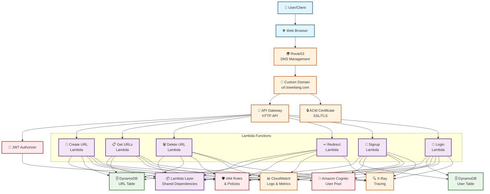
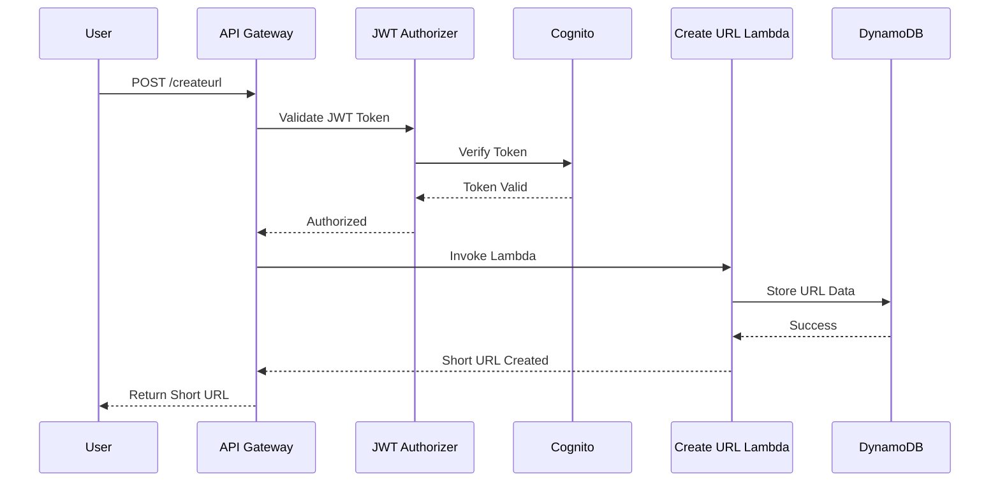
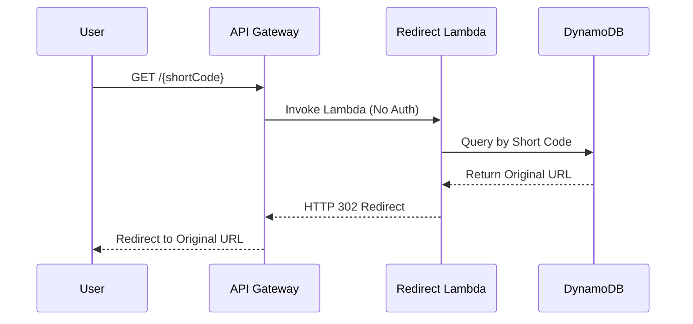
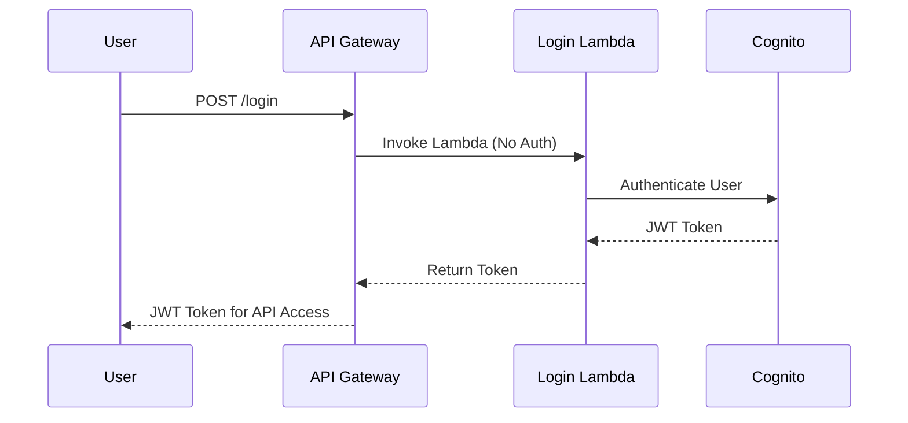
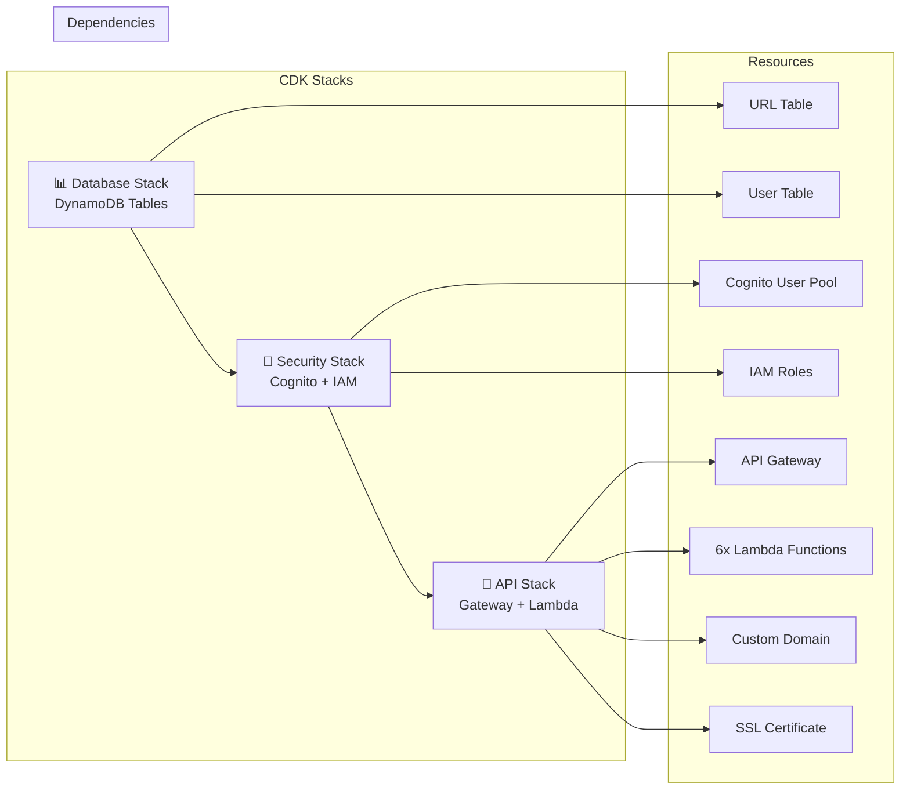
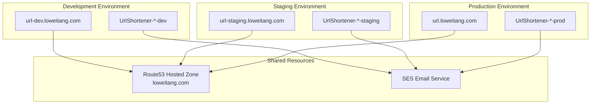
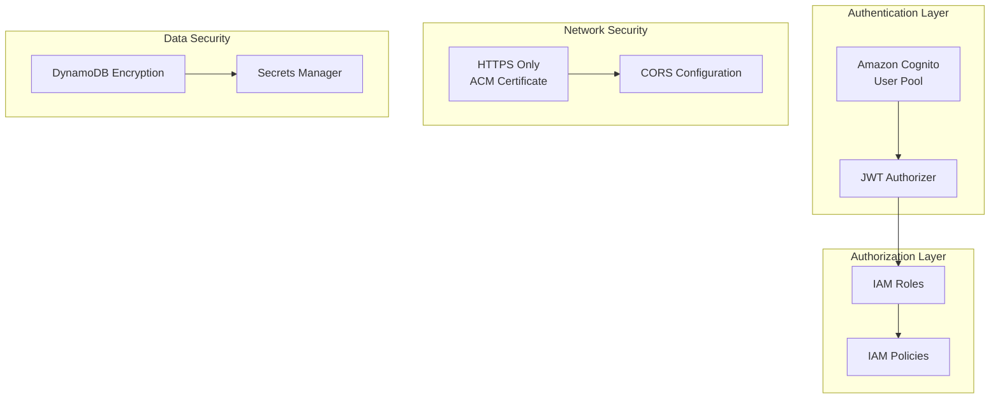
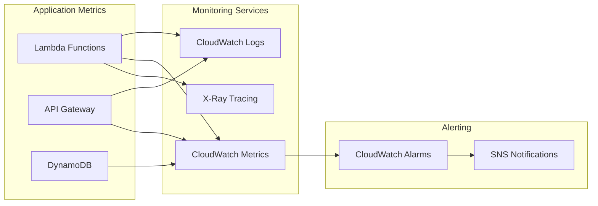

# 🏗️ URL Shortener Service - Architecture Diagram

> **🤖 Built with Amazon Q Developer**  
> Complete serverless architecture generated by AI

## 📊 System Architecture Overview

## 🔄 Data Flow Diagrams

### 1. URL Creation Flow

### 2. URL Redirect Flow

### 3. User Authentication Flow

## 🏗️ CDK Stack Architecture

## 🌍 Multi-Environment Architecture

## 📋 API Endpoints Overview

| Method | Endpoint | Auth Required | Lambda Function | Description |
|--------|----------|---------------|-----------------|-------------|
| POST | `/signup` | ❌ No | Signup Lambda | User registration |
| POST | `/login` | ❌ No | Login Lambda | User authentication |
| POST | `/createurl` | ✅ Yes | Create URL Lambda | Create short URL |
| GET | `/geturls` | ✅ Yes | Get URLs Lambda | List user URLs |
| DELETE | `/deleteurl/{id}` | ✅ Yes | Delete URL Lambda | Delete URL |
| GET | `/{shortCode}` | ❌ No | Redirect Lambda | Redirect to original |

## 🔒 Security Architecture

## 📊 Monitoring & Observability

---

## 🤖 Architecture Generated by Amazon Q Developer

This complete serverless architecture was designed and generated entirely by **Amazon Q Developer AI Assistant**, demonstrating:

- ✅ **Scalable Design**: Auto-scaling serverless components
- ✅ **Security Best Practices**: Multi-layer security implementation
- ✅ **High Availability**: Multi-AZ deployment ready
- ✅ **Cost Optimization**: Pay-per-use serverless model
- ✅ **Monitoring Ready**: Complete observability stack
- ✅ **Multi-Environment**: Dev/Staging/Production separation

**🎯 Total Components**: 20+ AWS Services integrated seamlessly
