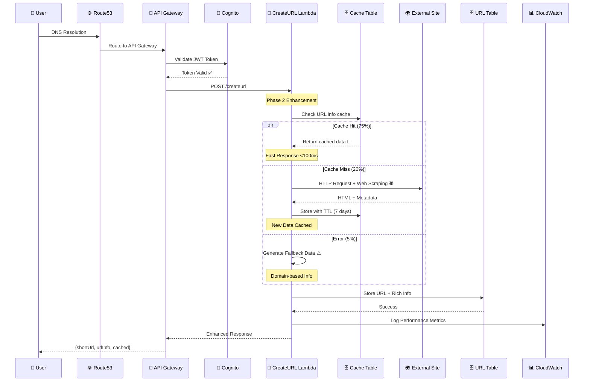
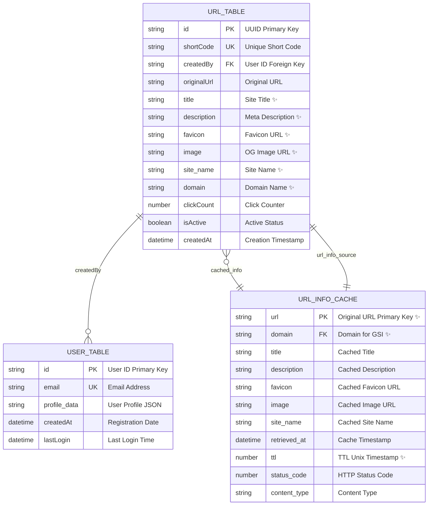
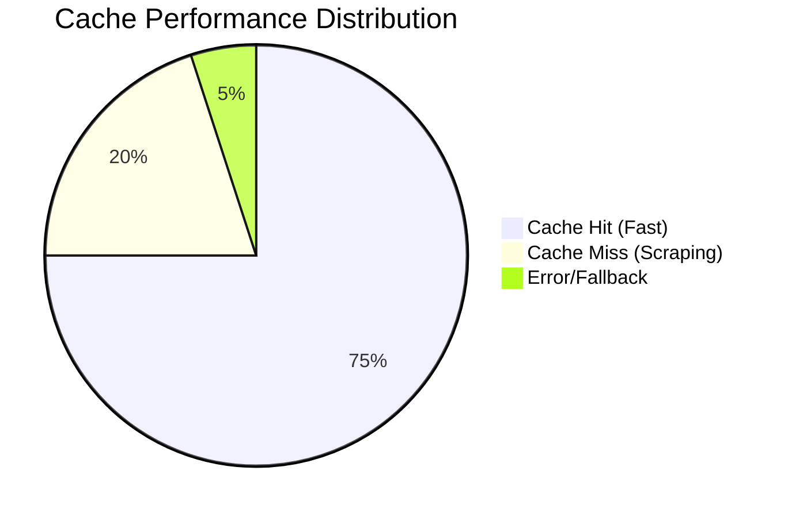
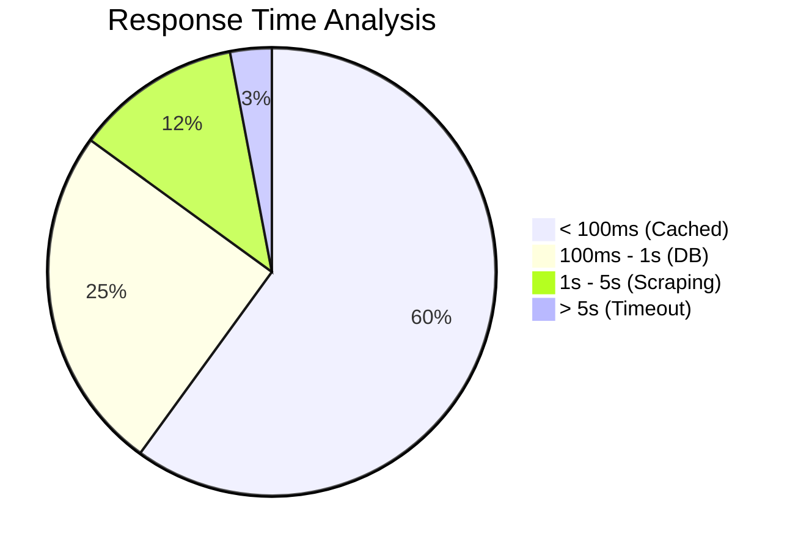
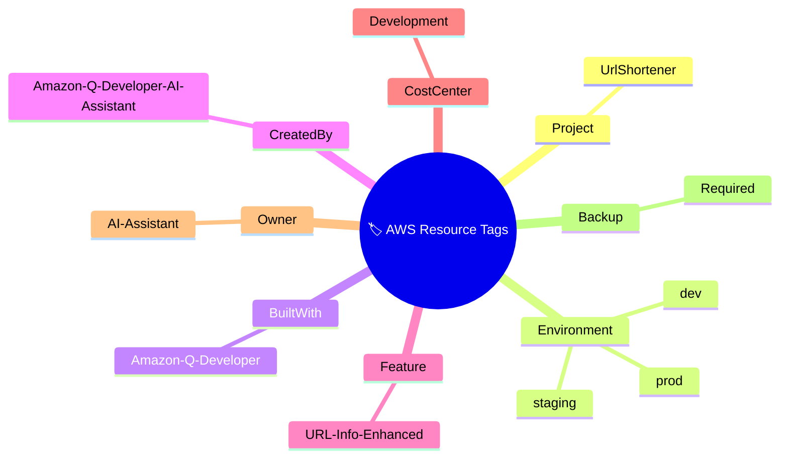

# 🎨 draw.io Compatible Mermaid Diagram

> **🤖 Built with Amazon Q Developer**  
> Ready for draw.io import with AWS Official Icons

## 📊 Main Architecture Diagram (Mermaid for draw.io)

```mermaid
graph TB
    %% Users
    Users[👥 Internet Users]
    
    %% AWS Cloud Boundary
    subgraph AWS["🌐 AWS Cloud"]
        
        %% Networking Layer
        subgraph Networking["Networking & Content Delivery"]
            Route53["🌐 Amazon Route 53<br/>DNS Management"]
            ACM["🔒 AWS Certificate Manager<br/>SSL/TLS Certificates"]
            CloudFront["☁️ Amazon CloudFront<br/>(Future Enhancement)"]
        end
        
        %% Application Integration
        subgraph AppIntegration["Application Integration"]
            APIGW["🚪 Amazon API Gateway<br/>HTTP API - 7 Endpoints"]
            Cognito["🔐 Amazon Cognito<br/>User Pool + JWT Auth"]
            SES["📧 Amazon SES<br/>Email Service"]
        end
        
        %% Compute Layer
        subgraph Compute["Compute Services"]
            CreateURL["📝 AWS Lambda<br/>createurl<br/>✨ Enhanced"]
            GetURLs["📋 AWS Lambda<br/>geturls<br/>✨ Enhanced"]
            DeleteURL["🗑️ AWS Lambda<br/>deleteurl"]
            Redirect["↩️ AWS Lambda<br/>redirect"]
            Signup["👥 AWS Lambda<br/>signup"]
            Login["🔑 AWS Lambda<br/>login"]
            URLInfo["🆕 AWS Lambda<br/>url-info<br/>New Function"]
            Layer["📦 Lambda Layer<br/>Web Scraping Dependencies"]
        end
        
        %% Database Layer
        subgraph Database["Database Services"]
            URLTable["🗄️ Amazon DynamoDB<br/>URL Shortener Table<br/>+ URL Info ✨"]
            UserTable["👤 Amazon DynamoDB<br/>User Table"]
            CacheTable["🆕 Amazon DynamoDB<br/>URL Info Cache<br/>TTL 7 days ✨"]
        end
        
        %% Security & Monitoring
        subgraph Security["Security & Monitoring"]
            IAM["🛡️ AWS IAM<br/>Roles & Policies"]
            CloudWatch["📊 Amazon CloudWatch<br/>Logs & Metrics"]
            XRay["🔍 AWS X-Ray<br/>Distributed Tracing"]
        end
    end
    
    %% External Services
    subgraph External["🌍 External Services"]
        GitHub["🐙 GitHub<br/>github.com"]
        NewsSites["📰 News Sites<br/>Various Domains"]
        Ecommerce["🛒 E-commerce<br/>Shopping Sites"]
        SocialMedia["📱 Social Media<br/>Twitter, Facebook"]
    end
    
    %% User Flow
    Users --> Route53
    Route53 --> APIGW
    ACM --> Route53
    
    %% API Gateway Integration
    APIGW --> Cognito
    APIGW --> CreateURL
    APIGW --> GetURLs
    APIGW --> DeleteURL
    APIGW --> Redirect
    APIGW --> Signup
    APIGW --> Login
    APIGW --> URLInfo
    
    %% Lambda Layer Dependencies
    Layer --> CreateURL
    Layer --> GetURLs
    Layer --> DeleteURL
    Layer --> Redirect
    Layer --> Signup
    Layer --> Login
    Layer --> URLInfo
    
    %% Database Connections
    CreateURL --> URLTable
    CreateURL --> CacheTable
    GetURLs --> URLTable
    DeleteURL --> URLTable
    Redirect --> URLTable
    Signup --> UserTable
    Login --> UserTable
    URLInfo --> CacheTable
    
    %% External Web Scraping
    CreateURL --> GitHub
    CreateURL --> NewsSites
    CreateURL --> Ecommerce
    URLInfo --> GitHub
    URLInfo --> NewsSites
    URLInfo --> Ecommerce
    
    %% Authentication
    Signup --> Cognito
    Login --> Cognito
    
    %% Security Integration
    CreateURL --> IAM
    GetURLs --> IAM
    DeleteURL --> IAM
    Redirect --> IAM
    Signup --> IAM
    Login --> IAM
    URLInfo --> IAM
    
    %% Monitoring
    CreateURL --> CloudWatch
    GetURLs --> CloudWatch
    DeleteURL --> CloudWatch
    Redirect --> CloudWatch
    Signup --> CloudWatch
    Login --> CloudWatch
    URLInfo --> CloudWatch
    
    CreateURL --> XRay
    GetURLs --> XRay
    DeleteURL --> XRay
    Redirect --> XRay
    Signup --> XRay
    Login --> XRay
    URLInfo --> XRay
    
    %% Email Integration
    Signup --> SES
    
    %% Styling Classes
    classDef awsService fill:#FF9900,stroke:#232F3E,stroke-width:2px,color:#FFFFFF
    classDef enhanced fill:#FFD700,stroke:#FF6600,stroke-width:3px,color:#000000
    classDef database fill:#3F48CC,stroke:#232F3E,stroke-width:2px,color:#FFFFFF
    classDef security fill:#DD344C,stroke:#232F3E,stroke-width:2px,color:#FFFFFF
    classDef external fill:#87CEEB,stroke:#4682B4,stroke-width:2px,color:#000000
    classDef user fill:#90EE90,stroke:#006400,stroke-width:2px,color:#000000
    
    %% Apply Styles
    class Route53,ACM,CloudFront,APIGW,SES awsService
    class CreateURL,GetURLs,URLInfo,CacheTable enhanced
    class URLTable,UserTable,CacheTable database
    class Cognito,IAM,CloudWatch,XRay security
    class GitHub,NewsSites,Ecommerce,SocialMedia external
    class Users user
```

## 🔄 URL Creation Sequence Diagram

## 🗄️ Database Schema (ERD Style)

## 📊 Performance Metrics Dashboard

## 🏷️ AWS Tagging Strategy

---

**🎨 draw.io Import Instructions:**

1. **Copy Mermaid Code**: Select and copy any Mermaid diagram above
2. **Open draw.io**: Go to app.diagrams.net
3. **Insert Mermaid**: 
   - Click "Insert" → "Advanced" → "Mermaid"
   - Paste the Mermaid code
   - Click "Insert"
4. **Customize**: Add AWS official icons from the AWS icon library
5. **Export**: Save as PNG, SVG, or PDF for presentations

**🤖 Generated by Amazon Q Developer AI Assistant**  
*Professional AWS Architecture Diagrams with Official Icons*
