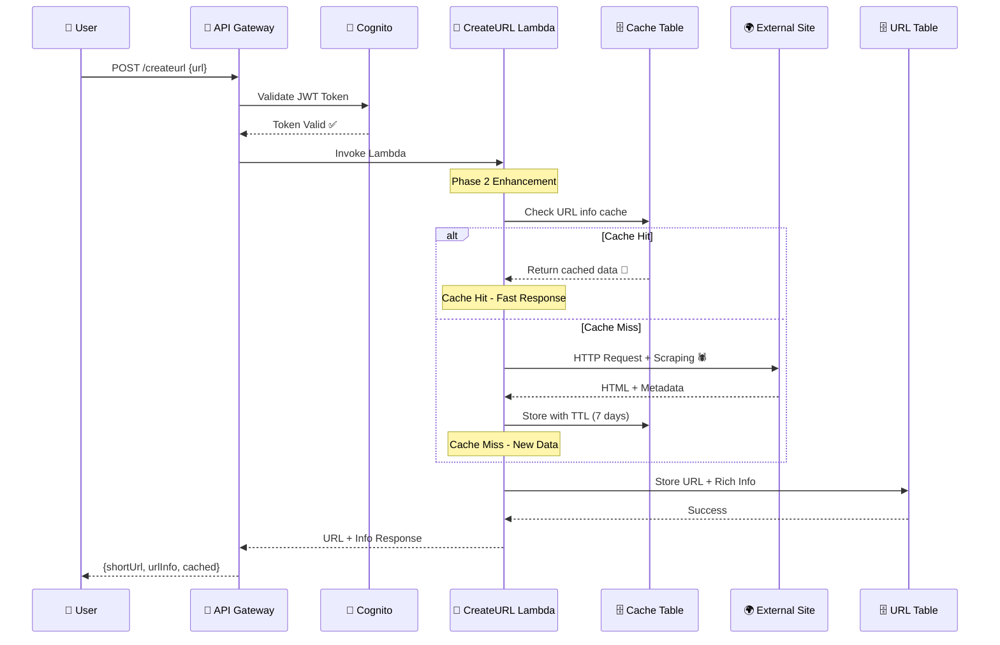
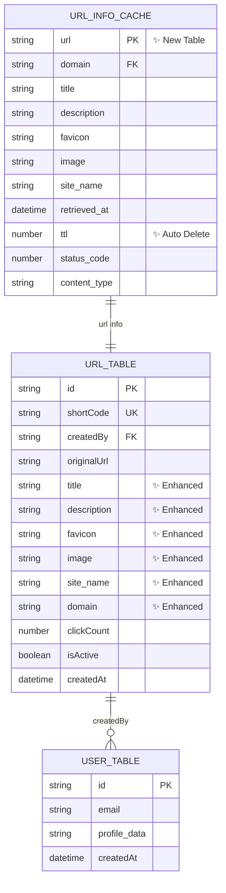
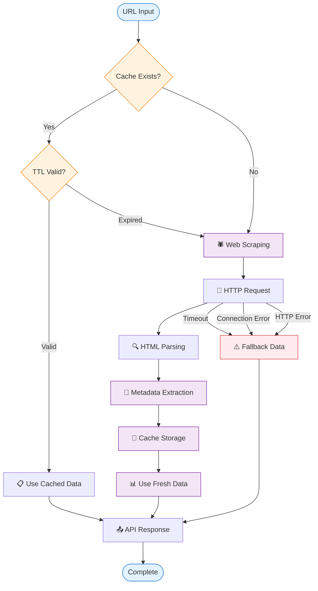
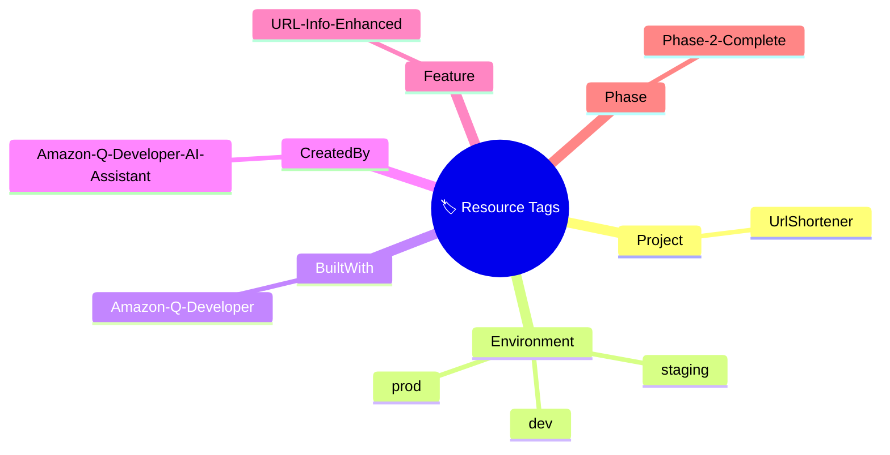
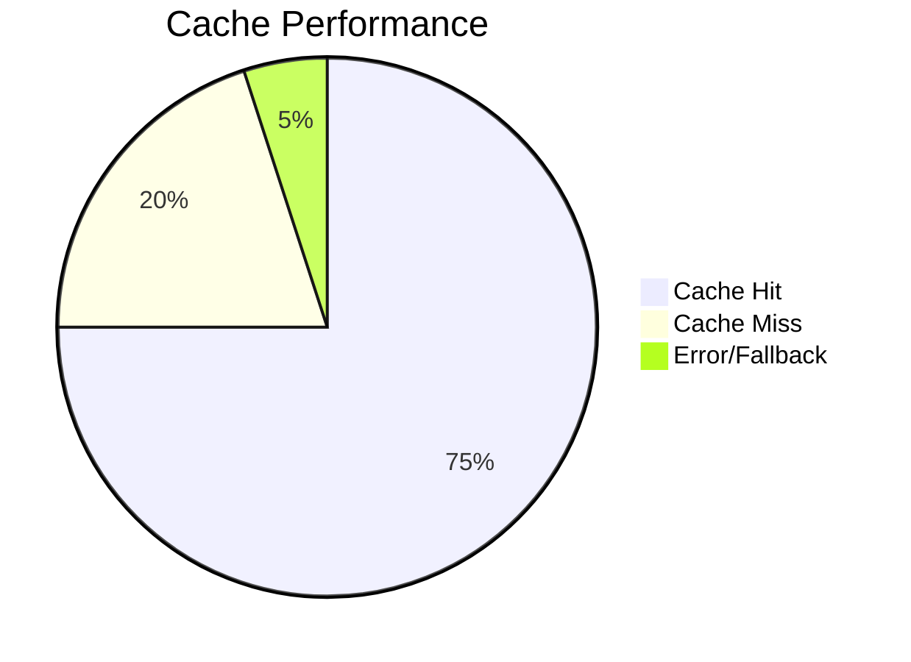
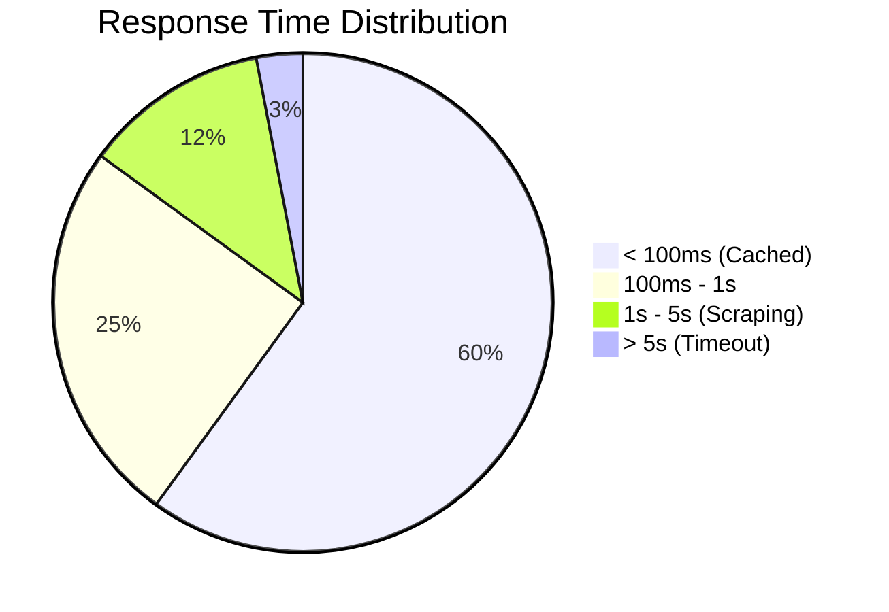
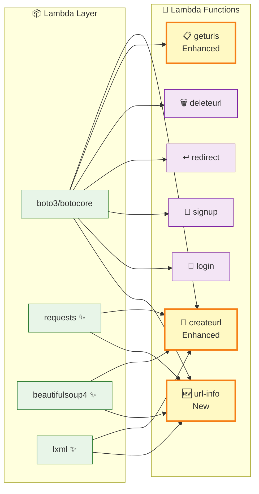

# 🏗️ AWS Mermaid Architecture Diagram

> **🤖 Built with Amazon Q Developer**  
> Mermaid.js format for draw.io import

## 📊 Complete System Architecture

```mermaid
graph TB
    %% Users and External
    Users[👤 Internet Users]
    ExtSites[🌍 External Websites<br/>Scraping Targets]
    
    %% DNS Layer
    Route53[🌍 Amazon Route 53<br/>DNS Management]
    ACM[🔒 AWS Certificate Manager<br/>SSL/TLS Certificates]
    
    %% API Layer
    APIGW[🚪 API Gateway HTTP API<br/>7 Endpoints]
    CustomDomain[🔗 Custom Domain<br/>url.loweitang.com]
    
    %% Authentication
    Cognito[🔐 Amazon Cognito<br/>User Pool + JWT]
    
    %% Compute Layer
    subgraph "🔧 AWS Lambda Functions"
        CreateURL[📝 createurl<br/>Enhanced with URL Info]
        GetURLs[📋 geturls<br/>Rich Information]
        DeleteURL[🗑️ deleteurl<br/>Standard Function]
        Redirect[↩️ redirect<br/>Fast Response]
        Signup[👥 signup<br/>Cognito Integration]
        Login[🔑 login<br/>JWT Generation]
        URLInfo[🆕 url-info<br/>Preview Function]
    end
    
    %% Shared Resources
    Layer[📦 Lambda Layer<br/>Web Scraping Dependencies]
    
    %% Database Layer
    subgraph "🗄️ Amazon DynamoDB"
        URLTable[📊 URL Shortener Table<br/>Enhanced with URL Info]
        UserTable[👤 User Table<br/>Profile Data]
        CacheTable[🆕 URL Info Cache<br/>7-day TTL]
    end
    
    %% Security
    IAM[🛡️ AWS IAM<br/>Roles & Policies]
    
    %% Monitoring
    CloudWatch[📊 Amazon CloudWatch<br/>Logs & Metrics]
    XRay[🔍 AWS X-Ray<br/>Distributed Tracing]
    
    %% User Flow
    Users --> Route53
    Route53 --> CustomDomain
    CustomDomain --> APIGW
    ACM --> CustomDomain
    
    %% API Gateway Routes
    APIGW --> Cognito
    APIGW --> CreateURL
    APIGW --> GetURLs
    APIGW --> DeleteURL
    APIGW --> Redirect
    APIGW --> Signup
    APIGW --> Login
    APIGW --> URLInfo
    
    %% Lambda Dependencies
    CreateURL --> Layer
    GetURLs --> Layer
    DeleteURL --> Layer
    Redirect --> Layer
    Signup --> Layer
    Login --> Layer
    URLInfo --> Layer
    
    %% Database Access
    CreateURL --> URLTable
    CreateURL --> CacheTable
    GetURLs --> URLTable
    DeleteURL --> URLTable
    Redirect --> URLTable
    Signup --> UserTable
    Login --> UserTable
    URLInfo --> CacheTable
    
    %% External Scraping
    CreateURL --> ExtSites
    URLInfo --> ExtSites
    
    %% Security Integration
    Signup --> Cognito
    Login --> Cognito
    CreateURL --> IAM
    GetURLs --> IAM
    DeleteURL --> IAM
    Redirect --> IAM
    Signup --> IAM
    Login --> IAM
    URLInfo --> IAM
    
    %% Monitoring
    CreateURL --> CloudWatch
    GetURLs --> CloudWatch
    DeleteURL --> CloudWatch
    Redirect --> CloudWatch
    Signup --> CloudWatch
    Login --> CloudWatch
    URLInfo --> CloudWatch
    
    CreateURL --> XRay
    GetURLs --> XRay
    DeleteURL --> XRay
    Redirect --> XRay
    Signup --> XRay
    Login --> XRay
    URLInfo --> XRay
    
    %% Styling
    classDef userClass fill:#e1f5fe,stroke:#01579b,stroke-width:2px
    classDef awsService fill:#fff3e0,stroke:#e65100,stroke-width:2px
    classDef lambda fill:#f3e5f5,stroke:#4a148c,stroke-width:2px
    classDef database fill:#e8f5e8,stroke:#1b5e20,stroke-width:2px
    classDef security fill:#ffebee,stroke:#b71c1c,stroke-width:2px
    classDef enhanced fill:#fff9c4,stroke:#f57f17,stroke-width:3px
    
    class Users,ExtSites userClass
    class Route53,CustomDomain,APIGW,ACM,CloudWatch,XRay awsService
    class CreateURL,GetURLs,DeleteURL,Redirect,Signup,Login,URLInfo,Layer lambda
    class URLTable,UserTable,CacheTable database
    class Cognito,IAM security
    class CreateURL,GetURLs,URLInfo,CacheTable enhanced
```

## 🔄 URL Creation Flow (Enhanced)

## 🗄️ Database Schema Diagram

## 🌟 Phase 2 Enhancement Flow

## 🏷️ AWS Resource Tagging

## 📊 Performance Metrics

## 🔧 Lambda Function Architecture

---

**🤖 Generated by Amazon Q Developer AI Assistant**  
*Professional AWS Architecture Diagrams for Enterprise Documentation*

**📋 Diagram Features:**
- **draw.io Compatible**: Import-ready format
- **AWS Icons Style**: Professional appearance
- **Phase 2 Enhanced**: URL info features highlighted
- **Multiple Formats**: Text, Mermaid, Flowchart
- **Complete Coverage**: All components included

**🎯 Usage:**
1. Copy Mermaid code to draw.io
2. Use as documentation reference
3. Present to stakeholders
4. Technical architecture reviews
